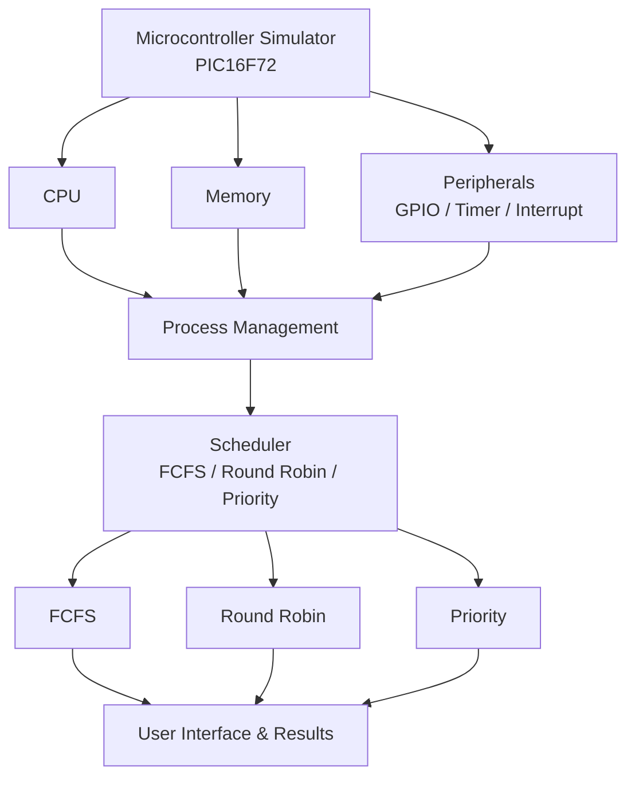

# microcontroller-simulator
## Project Title:
Educational Microcontroller Simulator with Process Scheduling

## Problem Objective:
The goal is to build a simple simulator that shows how a microcontroller runs programs, manages memory, and handles multiple programs at once. It  combines ideas from Microprocessor Architecture,Data Structures and Operating Systems into one working project, so we can see how a CPU actually runs code and decides which program gets to run next.

## Problem Statement:
Design and implement a software-based simulator for the assigned 8-bit microcontroller (PIC16F72). The simulator models the essential processor components, executes a defined subset of its instructions, and manages program memory, data memory, and stack, along with simplified GPIO, timer, and interrupt functionality. It also supports multiple programs as processes using a Process Control Block (PCB), ready queue, context switching, and the FCFS, Round Robin, and Priority scheduling algorithms.

## Project Scope:
- Copy how a processor works: registers, program counter, flags, memory, stack
- Run a set of instructions correctly
- Handle memory, stack, GPIO, timer, and interrupts
- Treat each running program as a separate process, with its own PCB
- Use data structures like stack, queue, circular queue, and an
  instruction lookup table
- Support FCFS, Round Robin, and Priority scheduling, with context switching
- Give a simple way to load, run, reset, and step through programs
- Show performance numbers like waiting time, turnaround time, response
  time, number of context switches, and CPU usage

## Microcontroller being simulated:
PIC16F72 - an 8-bit microcontroller with 35 instructions, 2000 words of program memory, banked data memory, an 8-level hardware stack, three timers, and an 8-channel analog-to-digital converter.

## Team Members:
Team leader: Ashritha.K-25190108
Pooja P Poojary - 25190137
Mohammed Nihal - 25190127
Nithin - 25190135

## Team Responsibilities:

Ashritha K 
Primary: CPU & Instruction Execution
Secondary: Integration & GitHub

Pooja P Poojary
Primary: Memory & Stack
Secondary: CPU support

Mohammed Nihal
Primary: Data Structures & Process Management
Secondary: Testing

Nithin
Primary: OS Scheduling & Context Switching
Secondary: UI & Integration

## Selected Program language:
Java 

## Initial System Architecture:
The simulator will be divided into the following main components:                

## Initial Development Plan:

The project will be developed step by step. The main planned stages are:

### Week 1 – Planning and Setup

* Set up the GitHub repository and project structure.
* Divide responsibilities among team members.
* Study the PIC16F72 architecture.
* Finalize Java as the programming language.
* Prepare the initial simulator architecture.

### Week 2 – CPU and Memory

* Design and implement the basic CPU components.
* Implement registers, Program Counter, flags, and instruction execution.
* Implement program memory, data memory, and stack.

### Week 3 – Peripherals

* Implement the selected instruction set.
* Add basic GPIO functionality.
* Add timer functionality.
* Add interrupt handling.

### Week 4 – Process Management

* Implement the Process Control Block (PCB).
* Implement process states and process creation.
* Implement the ready queue and required data structures.
* Implement context switching.

### Week 5 – Scheduling

* Implement FCFS scheduling.
* Implement Round Robin scheduling.
* Implement Priority scheduling.
* Calculate scheduling performance metrics.

### Week 6 – Integration and Testing

* Connect all major modules.
* Add program loading, run, reset, and single-step features.
* Test the complete simulator.
* Display performance results such as waiting time, turnaround time, response time, context switches, and CPU utilization.

The development plan is an initial plan and may be adjusted as the project progresses.

